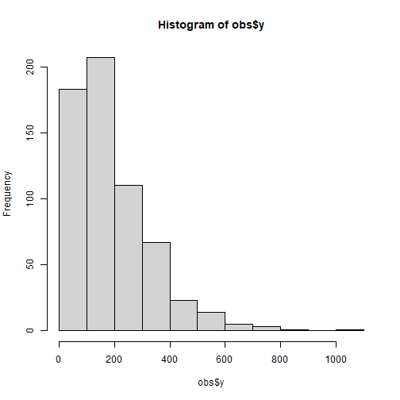

&nbsp;


&nbsp;


## Introduction to `SecDim` package

Load `SecDim` package


``` r
library(SecDim)
```

Here is an example of the spatial prediction using SDA models.

(1) Preparing data


``` r
# spatial data of response variables
data("obs")
# spatial data of optional SDA explanatory variables:
# b = 1, 3, 5, 7, and 9 km
# tau = seq(0, 1, 0.1)
# eight variables
data("sample_vars_sda")
```

(2) Data pre-processing: logarithm transformation and removing outliers


``` r
obs$y <- obs$Cr_ppm
hist(obs$y)
```



``` r
obs$y <- log(obs$y)
hist(obs$y)
```


``` r

krm <- rmvoutlier(obs$y)
## Remove 5 outlier(s)
y <- obs$y[-krm]
x <- lapply(sample_vars_sda, function(x) x[-krm,])
```

(3) selecting the second dimension variables for SDA models


``` r
system.time({
  sx <- selectvarsda(y, xlist = x)
})
##    user  system elapsed 
##    0.94    0.11    2.19
```

(4) SDA modeling


``` r
data.sda <- cbind(y, sx)
sda.lm <- lm(y ~ ., data.sda)
summary(sda.lm)
## 
## Call:
## lm(formula = y ~ ., data = data.sda)
## 
## Residuals:
##      Min       1Q   Median       3Q      Max 
## -1.92323 -0.47943  0.01662  0.39329  1.85379 
## 
## Coefficients:
##               Estimate Std. Error t value Pr(>|t|)    
## (Intercept) -8.963e+00  1.738e+00  -5.156 3.43e-07 ***
## v1X1         2.755e+00  7.064e-01   3.900 0.000107 ***
## v1X5        -3.105e-01  7.369e-01  -0.421 0.673627    
## v1X7        -2.773e-02  5.164e-01  -0.054 0.957198    
## v1X9         6.384e-02  5.040e-01   0.127 0.899253    
## v2X1        -2.225e-01  4.544e-01  -0.490 0.624624    
## v2X45       -8.250e-01  4.268e-01  -1.933 0.053701 .  
## v3X2        -2.335e-02  4.614e-01  -0.051 0.959663    
## v3X3         3.330e-01  4.369e-01   0.762 0.446328    
## v5X14        4.826e-05  1.052e-03   0.046 0.963423    
## v5X51       -2.067e-02  5.165e-03  -4.001 7.09e-05 ***
## ---
## Signif. codes:  0 '***' 0.001 '**' 0.01 '*' 0.05 '.' 0.1 ' ' 1
## 
## Residual standard error: 0.623 on 598 degrees of freedom
## Multiple R-squared:  0.3397,	Adjusted R-squared:  0.3286 
## F-statistic: 30.76 on 10 and 598 DF,  p-value: < 2.2e-16
```

(5) comparing with FDA


``` r
data("sample_vars_fda")
data.fda <- data.frame(y, sample_vars_fda[-krm,])
fda.lm <- lm(y ~., data.fda)
summary(fda.lm)
## 
## Call:
## lm(formula = y ~ ., data = data.fda)
## 
## Residuals:
##      Min       1Q   Median       3Q      Max 
## -2.38773 -0.40570  0.03638  0.42603  2.17528 
## 
## Coefficients:
##               Estimate Std. Error t value Pr(>|t|)    
## (Intercept) -3.138e+00  1.008e+00  -3.112  0.00195 ** 
## Elevation    3.580e-03  6.150e-04   5.821 9.53e-09 ***
## Slope       -1.701e-01  3.765e-02  -4.518 7.51e-06 ***
## Aspect       3.671e-05  3.210e-04   0.114  0.90899    
## Water       -2.398e-02  4.292e-03  -5.586 3.52e-08 ***
## NDVI        -5.053e-01  7.049e-02  -7.168 2.24e-12 ***
## pH           8.872e-01  1.598e-01   5.552 4.25e-08 ***
## SOC          3.560e+00  5.103e-01   6.976 8.05e-12 ***
## Road        -1.094e-02  3.594e-03  -3.043  0.00245 ** 
## ---
## Signif. codes:  0 '***' 0.001 '**' 0.01 '*' 0.05 '.' 0.1 ' ' 1
## 
## Residual standard error: 0.634 on 600 degrees of freedom
## Multiple R-squared:  0.3139,	Adjusted R-squared:  0.3047 
## F-statistic: 34.31 on 8 and 600 DF,  p-value: < 2.2e-16
```

&nbsp;


## Cross validation


``` r
R2 <- function(o, p) 1 - sum((o-p)^2)/sum((o-mean(o))^2)

## Example

# spatial data of response variables
data("obs")
# spatial data of optional SDA explanatory variables:
# b = 1, 3, 5, 7, and 9 km
# tau = seq(0, 1, 0.1)
# eight variables
data("sample_vars_sda")

# data pre-processing: logarithm transformation
obs$y <- obs$Cr_ppm
hist(obs$y)
obs$y <- log(obs$y)
hist(obs$y)
```


``` r
################################################
## SDA cross validation
################################################

# cross validation: 70% training and 30% testing
set.seed(100)
train <- sample(nrow(obs), 0.7*nrow(obs), replace = FALSE)

trainy <- obs[train,]
testy <- obs[-train,]
trainx <- lapply(sample_vars_sda, function(x) x[train,])
testx <- lapply(sample_vars_sda, function(x) x[-train,])

# removing outliers for training data
krm <- rmvoutlier(trainy$y)
trainy <- trainy$y[-krm]
trainx <- lapply(trainx, function(x) x[-krm,])

# generating explanatory variables for testing data
sdaxv <- sdapredvars(testx)

# selecting the second dimension variables for SDA models
system.time({
  sx <- selectvarsda(y = trainy, xlist = trainx)
})

# SDA modeling and prediction
data.sda <- cbind("y" = trainy, sx)
sda.lm <- lm(y ~ ., data.sda)
sda.lm.pred <- predict(sda.lm, newdata = sdaxv)
R2(testy$y, sda.lm.pred)
plot(testy$y, sda.lm.pred, xlim = c(3, 7), ylim = c(3, 7))

################################################
## FDA cross validation
################################################
data("sample_vars_fda")

# cross validation: 70% training and 30% testing
set.seed(100)
train <- sample(nrow(obs), 0.7*nrow(obs), replace = FALSE)

trainy <- obs[train,]
testy <- obs[-train,]
trainx <- sample_vars_fda[train,]
testx <- sample_vars_fda[-train,]

# removing outliers for training data
krm <- rmvoutlier(trainy$y)
trainy <- trainy$y[-krm]
trainx <- trainx[-krm,]

# FDA modeling and prediction
data.fda <- data.frame("y" = trainy, trainx)
fda.lm <- lm(y ~ ., data.fda)
fda.lm.pred <- predict(fda.lm, newdata = data.frame(testx))
R2(testy$y, fda.lm.pred)
plot(testy$y, fda.lm.pred, xlim = c(3, 7), ylim = c(3, 7))
```

{width=100%}

&nbsp;


&nbsp;
&nbsp;
